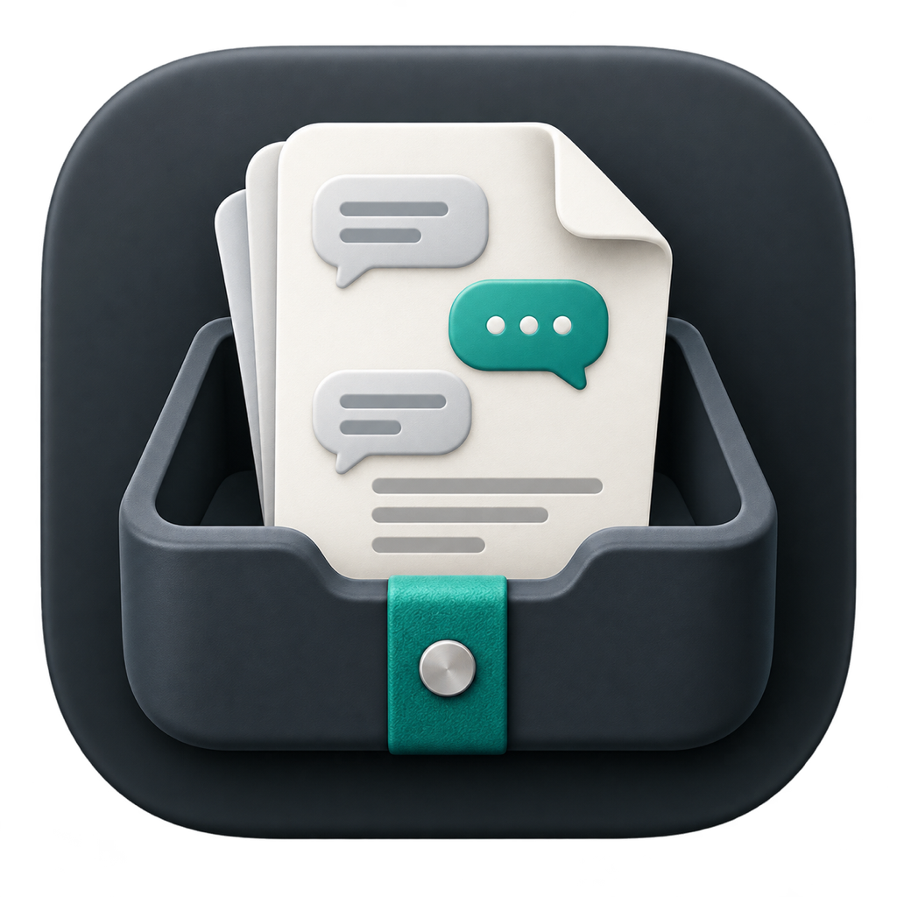

<div align="center">



# ChatUnpack

[Documentation](docs/DESIGN.md) | [验证与交接](docs/VALIDATION.md) | [Windows 计划](docs/WINDOWS-V0.1-PLAN.md)

</div>

<div align="center">

[](https://github.com/zaynzhu/chat-unpack/stargazers)
[](https://github.com/zaynzhu/chat-unpack/network/members)
[](https://github.com/zaynzhu/chat-unpack/issues)
[](https://github.com/zaynzhu/chat-unpack/commits)
[](https://www.apple.com/macos/)
[](https://www.microsoft.com/windows/)

</div>

<div align="center">

[中文](README.md) | [English](README_EN.md)

</div>

---

> [!TIP]
> ChatUnpack 是一个完全离线的个人桌面工具，只在用户主动确认后捕获一个微信合并聊天记录窗口，用系统本地 OCR 生成 Markdown。
> 全程不联网、不读取微信数据库、不注入微信进程——截图只在内存中短暂存在，结果由用户自行编辑、复制、保存和发送。
> 复制超过 1800 字符时自动沿消息边界分段，每段带序号和等待提示，最后一段通知可统一处理。

---

## ✨ Features

- **完全离线** -- 不联网、不上传任何数据，OCR 在本机完成
- **隐私优先** -- 不读取微信数据库/缓存/进程内存，不注入/Hook/调用微信内部接口，不自动发送消息
- **本地 OCR** -- macOS 用 Vision（zh-Hans + en-US），Windows 用 Windows.Media.Ocr，不依赖云端
- **自动滚动** -- 逐屏捕获 + 跨视口拼接，保留同一视口中的真实重复消息
- **保守解析** -- 无法确认发言人时输出"未知发言人"，无法区分媒体类型时输出通用占位符，不猜测
- **分段复制** -- Markdown 超 1800 字符自动按消息边界拆分，逐段写入剪贴板
- **双平台** -- macOS 13+ Apple Silicon（Swift）已验证；Windows 11 x64（C# .NET 8 WPF）支持截图导入（微信 4.x 防截屏后转向的方案，详见 docs/VALIDATION.md 2.5）
- **模拟测试** -- 内置 200 条完全虚构的 FixtureHost 窗口，不碰真实微信即可端到端验证

---

## 🚀 Quick Start

### macOS（已验证 v0.1.11）

```bash
# 克隆仓库
git clone https://github.com/zaynzhu/chat-unpack.git
cd chat-unpack

# 运行核心测试（121 项确定性检查）
swift run --arch arm64 ChatUnpackCoreTestRunner

# 构建应用
./scripts/setup-local-signing.sh   # 只需运行一次
./scripts/build-app.sh
./scripts/verify-app.sh

# 启动
open dist/ChatUnpack.app
```

### Windows（开发中 v0.1）

```bash
# 需要 .NET 8 SDK + Windows 11 23H2+ x64
dotnet restore .\windows\ChatUnpack.Windows.sln -p:Platform=x64
dotnet run --project .\windows\tests\ChatUnpack.Core.TestRunner -c Release
dotnet run --project .\windows\src\ChatUnpack.Windows -c Debug -p:Platform=x64
```

---

## 📦 Installation

### macOS

需要 macOS 13+、Apple Silicon、Swift 6 和 Xcode Command Line Tools。仓库不依赖第三方 Swift Package、Node.js 或 Homebrew 运行时。

```bash
./scripts/setup-local-signing.sh   # 首次：创建本地签名证书
./scripts/build-app.sh              # 构建 dist/ChatUnpack.app
./scripts/verify-app.sh             # 验证版本、架构、签名
```

`setup-local-signing.sh` 只需运行一次：在当前用户登录钥匙串中创建仅供 ChatUnpack 本地构建使用的代码签名证书，不导出或保留私钥文件。个人自用首次打开时可能需要在 Finder 中右键选择"打开"。

### Windows

需要 Windows 11 23H2+、x64、.NET 8 SDK。当前处于开发预览阶段。

```powershell
dotnet build .\windows\ChatUnpack.Windows.sln -c Debug -p:Platform=x64
dotnet build .\windows\ChatUnpack.Windows.sln -c Release -p:Platform=x64
dotnet run --project .\windows\src\ChatUnpack.FixtureHost.Windows -c Debug
```

### 模拟测试窗口

在不触碰真实微信的前提下启动 200 条虚构消息的滚动窗口：

```bash
# macOS
./scripts/run-fixture-host.sh

# Windows
.\windows\scripts\run-fixture-host.ps1
```

---

## 💡 Usage

### 基本流程

**macOS（窗口捕获）：**

1. 在官方微信中打开一份合并聊天记录详情窗口
2. 点击 ChatUnpack 的「开始汇总」或使用全局快捷键
3. 确认一次性目标预览，扫描期间不要操作目标窗口
4. 在结果页检查和编辑 Markdown
5. 逐段复制或保存完整 Markdown，再由你自行发送

**Windows（截图导入）：**

1. 在微信中用自带截图（Alt+A）分屏截取合并记录，相邻截图保留部分重叠
2. 在 ChatUnpack 中 Ctrl+V 粘贴或拖拽图片文件入队列
3. 点击开始识别，应用本地 OCR 并跨图去重拼接
4. 在结果页检查和编辑 Markdown，逐段复制或保存

ChatUnpack 不会替你选择微信消息、打开聊天记录卡片或发送内容。

### 隐私边界

- 不读取微信数据库、缓存、日志或进程内存
- 不注入、Hook、调用微信内部接口，不自动发送消息或文件
- 不联网，不上传 OCR 图片、聊天文字或诊断内容
- 未主动点击「开始汇总」前，不枚举、捕获或监听微信窗口
- 结果默认只保存在内存中；只有点击「复制」或「保存」时才写入剪贴板或文件
- 截图只在用户确认的扫描流程中短暂保留于内存，禁止落盘

---

## 📚 Documentation

| 主题 | 说明 |
|------|------|
| [产品设计与隐私不变量](docs/DESIGN.md) | 产品边界、隐私红线和技术设计 |
| [验证与交接](docs/VALIDATION.md) | 当前实现、验证证据、已知限制和交接状态 |
| [Windows v0.1 实施计划](docs/WINDOWS-V0.1-PLAN.md) | Windows 版范围、架构、阶段和验收层级 |
| [Windows 首次实机交接](docs/WINDOWS-FIRST-RUN-HANDOFF.md) | 真实 Windows 首次执行的步骤和检查项 |

---

## 🔒 权限

应用只会在用户主动开始时检查：

- **辅助功能**（macOS）/ 无（Windows）：用于确认目标窗口、检测窗口变化和执行滚动
- **屏幕录制**（macOS）：用于捕获用户确认的单个记录窗口

应用不申请完全磁盘访问、通讯录、相册、相机、麦克风或位置权限，也不尝试绕过系统安全提示。权限检查不会在启动、后台常驻或开机自启时运行。

---

## 📋 当前状态

### macOS（已验证 v0.1.11 build 12）

SwiftUI 界面、菜单栏与快捷键、设置、导出、单窗口内存捕获、Vision OCR、自动滚动、跨屏拼接、Markdown 分段复制和本地稳定签名均已接入。核心逻辑通过 121 项确定性检查，Debug/Release/arm64 bundle 和签名均已验证。

### Windows（开发中 v0.1）

C# .NET 8 + WPF 客户端。2026-08-29 实测确认微信 4.x 对全部窗口设置 `WDA_EXCLUDEFROMCAPTURE` 防截屏，窗口捕获式扫描对官方微信不可行（证据见 [VALIDATION 2.4](docs/VALIDATION.md)）；已按计划停止条件转向**截图导入**模式——用户用微信自带截图（Alt+A）分屏截取，应用本地 OCR、跨图拼接、Markdown 导出，管线已实机验收（见 [VALIDATION 2.5](docs/VALIDATION.md)）。自动扫描入口仅保留 Fixture 调试模式。

| 能力 | macOS | Windows |
|------|--------|---------|
| 应用入口 | SwiftUI + 菜单栏 + 快捷键 | WPF + 截图导入页 |
| 输入 | ScreenCaptureKit 窗口捕获 | 微信自带截图（Alt+A）粘贴/拖拽 |
| OCR | Vision（含置信度） | Windows.Media.Ocr + 深色图预处理 |
| 滚动/拼接 | 自动滚动 + 相邻视口最长重叠 | 跨图拼接，同一算法移植 |
| 导出 | Markdown 分段复制 + 保存 | 同一格式移植 |
| 打包 | arm64 本地签名 | self-contained x64（未签名） |
| 真实验收 | 用户已自行试用并反馈 | 截图导入管线实机验收通过 |

---

## ⚠️ 当前限制

- OCR 无法恢复画面中根本没有识别出的昵称；无可靠候选时保留"未知发言人"
- 只有可见文字信号足够明确时才区分图片、语音、视频等类型，否则输出通用非文字占位符
- 微信界面变化可能影响时间锚点、昵称和正文边界，发送前仍需人工检查
- 应用不保存扫描历史，也不提供自动更新或公开分发安装器
- Windows 截图导入管线已实机验收，但真实微信截图的 OCR 质量（昵称漂移、表情/图片占位）尚未用真实记录充分校准，结果页可手动编辑兜底

---

## ❓ FAQ

<details>
<summary>ChatUnpack 会读取我的微信数据或联网上传吗？</summary>

不会。它不读取微信数据库、缓存、日志或进程内存，不注入、Hook 或调用微信内部接口，不联网，不上传截图、OCR 文字或日志。所有处理都在本机完成，结果只写入系统剪贴板或你选择的文件。

</details>

<details>
<summary>为什么 Windows 版改为截图导入，而不是自动扫描窗口？</summary>

2026-08-29 实测确认微信 4.x 对全部窗口设置了 `WDA_EXCLUDEFROMCAPTURE` 防截屏保护，所有标准截屏通道（WGC/GDI/PrintWindow）均无法捕获，绕过只能靠注入或读进程内存——属于隐私红线禁止。截图导入用微信自带截图（Alt+A）作为输入，全程不触碰微信进程（完整证据见 [VALIDATION 2.4](docs/VALIDATION.md)）。

</details>

<details>
<summary>macOS 版为什么只支持 Apple Silicon？</summary>

当前已验证的构建、签名和 121 项核心检查都基于 Apple Silicon（`arm64`）。这是个人自用项目，按实际设备收敛验证范围；Intel Mac 未验证、不承诺。

</details>

<details>
<summary>OCR 结果能直接使用吗？</summary>

发送前必须人工检查。OCR 无法恢复画面中未识别出的昵称（会保留"未知发言人"），深色截图、紧凑行距或生僻字仍可能误认，微信界面变化也可能影响时间锚点和正文边界。应用刻意保守输出而不是猜测。

</details>

---

## ⭐ Star History

<a href="https://star-history.com/#zaynzhu/chat-unpack&Date">
 <picture>
   <source media="(prefers-color-scheme: dark)" srcset="https://api.star-history.com/svg?repos=zaynzhu/chat-unpack&type=Date&theme=dark" />
   <source media="(prefers-color-scheme: light)" srcset="https://api.star-history.com/svg?repos=zaynzhu/chat-unpack&type=Date" />
   
 </picture>
</a>

---

## 🙏 Contributors

<a href="https://github.com/zaynzhu/chat-unpack/graphs/contributors">
 
</a>
